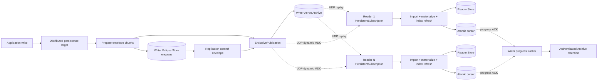

# Aeron clustering middleware integration plan

Status: core transport implemented; release gates and operational hardening are tracked below

Scope: fixed one-writer, N-reader Eclipse DataGrid topology

Target transport: Aeron reliable UDP with Aeron Archive
Consensus: intentionally out of scope
JCache invalidation: `cache/clustered/aeron` adapter in scope (synchronous sender, fail-closed receiver)

Implementation snapshot: `storage-distributed-aeron` now contains the optional
fixed-envelope publisher, Archive publisher, live and Archive-backed readers,
cursor codec, write coordinator, Archive-first persistence-target adapter,
atomic fixed checkpoint files, recording extension support, and JUnit/unit plus
embedded dynamic-MDC UDP/Archive integration
tests. The provider also deploys a separate latest-value Aeron stream for
authenticated reader watermarks. An embedded writer configured with a shared
secret and fixed reader UUID set validates and durably tracks the complete
quorum before segment-aligned Archive retention can run. Missing configuration,
an incomplete quorum, or an active replay keeps history intact. Embedded writers now
provide a configurable local Archive free-space admission threshold and expose
the measured usable space through health; external Archives must enforce their
own capacity policy. The cluster lifecycle now has no Kafka imports: `cluster-nodelibrary-kafka`
and `cluster-nodelibrary-aeron` are selectable provider modules discovered
through the neutral SPI, while `storage-distributed` remains provider-free.
The neutral persistence configurator accepts a provider target factory, so the
Aeron provider can preserve Archive-prepare/local-enqueue/Archive-commit
ordering without leaking Aeron into the core artifact. The Aeron packet path
also waits for the neutral merger's completed materialization hook before
advancing its cursor. Backup artifacts now have a forced manifest/ready
publication boundary and startup applies generation-aware local precedence.
Cross-backend restore validation, an unconditional filesystem-force contract
for Store completion, and Lucene/vector readiness remain explicit follow-on
gates; the release checklist below does not claim those production hooks are
complete until their phase tests pass.
Framework adapters are also
provider-neutral: Spring Boot, Micronaut, and Helidon depend only on the
neutral nodelibrary, and an application adds exactly one provider module.
The neutral storage root defaults to `/storage` and may be overridden with
`ECLIPSE_DATAGRID_STORAGE_PATH`; the offset file and SaaS backup scratch space
follow that root. The independent `cache/clustered/aeron` module adds the same
Aeron dependency to the JCache timestamp-invalidation path. Its sender is
synchronous and fails the local cache write when it cannot publish, matching
the Kafka adapter, so switching transports does not change cache semantics; it
carries no Store durability guarantee and is never used to recover Store state.

Readers and backup readers use `ECLIPSE_DATAGRID_AERON_RECORDING_ID` when it is
configured. Otherwise they query the writer Archive for the configured live
channel alias and stream ID and proceed only when exactly one recording matches;
zero or multiple matches fail startup with an explicit diagnostic. Embedded
writers enable Aeron spy connection simulation so the local Archive can keep a
recorded publication connected with zero remote readers; an explicit
`ssc=false` channel option disables that behavior. The production default is
dedicated MediaDriver/Archive threading; shared threading is intended for
development and tests.
The neutral merger's normal coalescing timeout is bypassed at an Aeron
transaction boundary, so the resolved-cursor callback is emitted only after
synchronous object-graph materialization rather than after an arbitrary
batching delay. The provider opens a separate latest-value Aeron watermark
stream. Readers persist their ordinary recording cursor first, then advertise
the same durable boundary to the writer. The writer requires the complete
configured reader quorum before retention maintenance can run.

Current working-tree status is intentionally split into implementation classes:

| Area | Current state | Release interpretation |
|---|---|---|
| Core Aeron transport, Archive replay/live join, atomic writer/reader cursors, one-writer/N-reader lifecycle, failure propagation, and crash barriers | Implemented and covered by unit, UDP/Archive, Store, benchmark, and process tests | Eligible for normal transport review |
| Real Store integration (four channels, three readers, restart, dictionary rejection/retry, embedded Lucene/JVector persistence) and the full-path benchmark | Implemented; benchmark numbers are diagnostic rather than machine-dependent gates | Required regression coverage is present; live transient-index refresh is still a separate Store lifecycle gate |
| Authenticated watermark delivery/retention and Archive free-space admission | Implemented for an embedded writer when the secret and fixed reader set are configured; otherwise fail closed | Opt-in operational feature; requires the private-network and runbook requirements below |
| Backup artifact visibility (manifest + ready marker), generation-aware local precedence, live Lucene/JVector rematerialization, and slow-reader/replay fan-out | Artifact visibility and local cursor precedence are implemented; cross-backend restore validation and the remaining lifecycle/index/fan-out behavior are not implemented or not proven | Only complete, marked backups are selectable; cross-backend conflicts, live index refresh, and slow-reader/replay limits remain explicit release gates |
| In-process writer promotion | Explicitly rejected for the fixed-role Aeron provider | A reader cannot be promoted by `StorageNodeManager`; a future promotion protocol must fence the old writer and establish a new recording/epoch before changing role |

## 1. Decision and feasibility

The integration is feasible and should be implemented as an additional transport, not as a rewrite of Eclipse Store persistence.

The recommended design is:

- keep Eclipse Serializer/Eclipse Store binary data as the authoritative replication payload;
- wrap those opaque bytes in a small, versioned fixed binary replication envelope;
- run an embedded `ArchivingMediaDriver` on the writer and an embedded `MediaDriver` on each reader;
- publish live data over UDP dynamic Multi-Destination-Cast (MDC);
- record the writer publication locally and durably in Aeron Archive;
- use `PersistentSubscription` on readers to replay, join live, and recover automatically after falling behind;
- retain the existing backup/bootstrap mechanism, replacing Kafka offsets with an Aeron recording position;
- propagate persistent Lucene/vector source state through the normal Eclipse Store payload and rebuild or reopen node-local derived indexes.

This is a good fit when the writer is known by configuration and automatic leader election is not required. It removes the operational Kafka cluster, but it does **not** provide automatic writer failover, split-brain protection, or multi-writer ordering. Those require Aeron Cluster/Raft or another fencing/consensus mechanism and are explicitly deferred.

The strongest design makes the Archive the recovery WAL: archive a prepared transaction, wait for Eclipse Store's storage task to complete, then archive a replication commit marker. In the Store 5 source used by this project, `StorageRequestAcceptor.storeData(Binary)` calls `waitOnTask(enqueueStoreTask(data))`; a normal return therefore proves task completion, not merely queue admission. It still does **not** prove an unconditional per-transaction filesystem force: Store follows its configured synchronization and rollover policy. The commit marker therefore means “the transaction is durable in Archive and the writer Store task completed under the configured Store durability policy.”

Phase 0 must prove duplicate `StorageConnection.importData` plus live-object rematerialization across restart. The Store API documents replacement by object ID, so the result is expected to be storage-idempotent, but the complete DataGrid behavior must still be tested. If that proof fails, use `ENQUEUE_THEN_ARCHIVE` compatibility mode and accept its detected-but-not-repairable crash gap. The former `LOCAL_DURABLE_FIRST` experiment is intentionally removed: the Store API does not expose a durable-completion boundary that the replication coordinator can verify, so configuration rejects that value instead of pretending it is safe.

## 2. Goals, guarantees, and non-goals

### Goals

1. One configured writer replicates every committed Eclipse Store binary update to any number of configured readers.
2. The writer continues accepting writes when zero readers are online, subject to Archive disk capacity.
3. A late, restarted, disconnected, or slow reader resumes from its durable Aeron position without Kafka.
4. Type dictionaries always precede data that references their type IDs.
5. A reader never imports a partial logical Eclipse Store write.
6. Reader readiness is false until replay has joined the live publication and
   the durable object-graph materialization boundary has completed. The
   current provider does not expose a configurable lag-byte threshold; it
   reports `REPLAYING` until the subscription is live and reports failures
   instead of guessing freshness from a local cursor.
7. Existing Kafka behavior remains available during migration and its tests continue to pass.
8. Backups contain the replication cursor required to replay from the writer Archive.
9. GigaMap bitmap, Lucene, and vector searches on readers converge to writer results.
10. JCache timestamp invalidation can run over Aeron without Kafka, as an
    independent module whose synchronous sender fails the local cache write
    exactly as the Kafka adapter does and which carries no Store-replication
    durability guarantee.

### Initial guarantees

- Topology: exactly one configured writer; zero or more readers and an optional backup reader.
- Ordering: total order per writer publication, checked again with a monotonic logical transaction sequence.
- Delivery: committed transactions are recoverable from Archive; reader application is at least once at the crash boundary and must be storage-idempotent.
- Consistency: eventual between nodes, unchanged from DataGrid's stated model; fully consistent within a node while an imported batch is applied under its write lock.
- Durability: the replication acknowledgement is controlled by the configured
  `...file-sync-level` (applied to both Archive segments and its catalog);
  production defaults are `1`, with `2` available for metadata forcing and `0`
  restricted to development/performance experiments. This is Archive
  durability, not proof of completion by Store's asynchronous writer.
- Backpressure: the writer is gated by its local Archive recording progress, not by the slowest reader. Slow readers recover from replay.
- Availability: the writer Archive/catalog is a single durable recovery dependency in v1. Host/disk loss requires a matched backup or optional replicated Archive; it is not masked by the fixed-reader topology.

### Non-goals

- leader election, quorum writes, Raft, split-brain prevention, or transparent writer promotion;
- multi-writer conflict resolution;
- copying raw Lucene or JVector sidecar directories between hosts;
- exposing Eclipse object layouts in the transport envelope;
- custom compression or encryption in the first release;
- exactly-once effects outside Eclipse Store.

## 3. Evidence and source baseline

The plan was derived from the checked-out source, examples, tests, and documentation in all local projects, plus the linked [DataGrid discussion #16](https://github.com/eclipse-datagrid/datagrid/discussions/16). It was then checked against the independent GLM, big-pickle, Muse, Ling, MIMO, DS, and Kimi reviews supplied with the repository. Review claims were accepted only when confirmed in source; for example, `java.util.zip.CRC32C` does exist on the Java 17 baseline, the current cursor contract is `ReplicationCursor`, `alias` is an Aeron channel parameter, and Aeron's default term buffer is 16 MiB, so contrary review claims about those points were not adopted.

| Project | Material used | Design consequence |
|---|---|---|
| DataGrid | `README.md`; `storage/distributed/*`; `cluster/nodelibrary/*`; current Kafka distributor/client, packet acceptor, merger, backup and position code; Aeron provider and Store integration tests | Reuse the existing persistence-target and type-dictionary interception seams, but remove Kafka types from cluster lifecycle and cursor abstractions. The current tree contains unit, UDP/Archive, Store, benchmark, and forked process tests; new tests extend those seams rather than replacing them. |
| Aeron | `RecordedBasicPublisher`, `PersistentSubscriber`, `ReplayMergeSubscriber`, `EmbeddedRecordingThroughput`, `ReplayedBasicSubscriber`, Archive scripts README, Archive/system tests for recording extension | Use a recorded `ExclusivePublication`, wait for `RecordingPos`, extend the same recording after writer restart, and prefer `PersistentSubscription` over hand-built `ReplayMerge`. |
| Aeron docs | [Archive overview](https://aeron.io/docs/aeron-archive/overview/), [MDC and flow control](https://aeron.io/docs/aeron/multi-destination-cast/), [publications/subscriptions](https://aeron.io/docs/aeron/publications-subscriptions/), [multi-host Archive sample](https://aeron.io/docs/aeron-archive/multi-host-sample/), [purging](https://aeron.io/docs/aeron-archive/purging-and-truncation/) | Use UDP for remote Archive control/replay, dynamic MDC for fan-out, application message assembly, explicit offer-result handling, and segment-aligned retention. |
| Agrona | `README.md`, `AgentRunner`, `BackoffIdleStrategy`, `UnsafeBuffer`, counters | Own publication/subscription on a duty-cycle thread where needed, use direct buffers and counters, and default to a low-CPU backoff strategy with a latency-tuned override. |
| SBE | `README.md`, `example-schema.xml`, `common-types.xml`, `ExampleUsingGeneratedStub` and extension example | Evaluated as an envelope option. The first implementation uses a fixed Agrona/`ByteBuffer` header to avoid a build-time code generator; SBE remains a compatible future schema if rolling protocol evolution requires it. |
| Eclipse Serializer | `README.md`, `Binary`, `ChunksBuffer`, `ChunksWrapper`, `BinaryStorer`, persistence dictionary manager; 5.0 snapshot's coalesced pending dictionary export and crash-safe dictionary file swap | Preserve the ordered `Binary` byte stream as opaque data. Exact `ByteBuffer` boundaries are not semantic and the existing Kafka distributor already flattens/re-slices them. Serializer 5 exports pending type changes once per store, immediately before data, and its dictionary file handler heals interrupted swaps. DataGrid's caching wrapper remains a compatibility guard and must be tested against the real exporter seam. Never model an arbitrary object graph in the transport envelope. |
| Eclipse Store | GigaMap source/docs, Lucene implementation/lifecycle tests, JVector `README.md`, `ARCHITECTURE.md`, persistence handlers and lifecycle tests | Persistent index source state travels in the normal Store payload. Embedded Lucene graph files and persisted JVector vectors can travel with it. External Lucene and JVector directories are rejected by Data Grid. |

Version baseline for the spike:

- Java 17, matching DataGrid and Aeron minimums;
- Aeron `1.53.0` as the release baseline verified by the local tag and changelog; require `>= 1.51.0` because `PersistentSubscription` was introduced there, and re-check Maven Central plus the Aeron changelog when implementation begins;
- use Aeron's transitive Agrona version; do not override it independently;
- compile and test DataGrid against the local Eclipse Store/Serializer `5.0.0-SNAPSHOT` artifacts;
- use Store 5's Lucene store-boundary and JVector/GigaMap fixes, but keep index replication experimental until the embedded rematerialization tests below pass on every supported filesystem.

Do not silently upgrade to an Aeron snapshot. The build is pinned to Aeron
`1.53.0`; the local Aeron checkout may be newer and is useful only as API/test
reference until a version change is deliberately reviewed.

## 4. Current DataGrid flow and gaps

Current writer path:

```text
application store
  -> Eclipse Store PersistenceTarget.write(Binary)
  -> DistributedStorage provider target
       Aeron: coordinator -> Archive prepare -> local Store -> Archive terminal
       Kafka: local Store -> packet distributor (legacy ordering)
```

`EmbeddedStorageBinaryTarget.write` waits for its storage task. The current ordering is “local Store task completion, then Kafka publish”; whether completion includes a filesystem force depends on Store synchronization and rollover policy.

Current reader path:

```text
selected transport poll/replay
  -> provider-specific packet or complete-binary adapter
  -> ClusterStorageBinaryDataMerger
       1. StorageConnection.importData(...)
       2. ObjectMaterializer reloads live objects
       3. provider cursor callback after materialization
```

Reusable seams already exist, but the cluster layer still carries a few legacy
transport assumptions:

- Kafka cursor bytes are provider-owned; the neutral `ReplicationCursor`
  contract no longer exposes Kafka classes;
- provider-specific clients remain behind the generic
  `ClusterStorageBinaryDataClient`/distributor interfaces;
- Kafka and Aeron both use the atomic cursor path; their provider positions
  remain distinct and are never decoded by the other transport;
- the filesystem backup backend publishes a forced manifest and final ready
	marker last, while the network backend puts the manifest in the single
	uploaded archive; interrupted filesystem backup directories are ignored;
	storage-node startup compares the local cursor with the newest backup and
	restores on unknown/mismatched/older state while retaining a newer local image;
- the asynchronous merger now waits for materialization before advancing any
  transport cursor;
- the separate `cache/clustered/kafka` and `cache/clustered/aeron` JCache
  invalidation modules are independent transports and are not part of Store
  binary replication;
- unit, crash-matrix, embedded UDP/Archive, and real four-channel Store tests
  protect the main replication contract; the Store fixture covers three
  independent readers, restart, dictionary retry, and embedded Lucene/JVector
  persistence;
- transient Lucene/JVector runtime state is not proven to refresh when an
  already-live reader rematerializes persisted objects, and backup-manifest
  precedence/slow-reader behavior remain separate acceptance gates;
- Aeron `positionProvider().latest()` is writer-only. A reader cannot infer the
  writer's durable boundary from its own applied cursor, so the neutral SPI
  deliberately raises `UnsupportedOperationException` for reader/backup roles.

These are integration concerns, not reasons to fork Eclipse Store serialization or introduce Aeron Cluster.

## 5. Target architecture



### Network shape

- Live publication: dynamic MDC over UDP. Writer channel shape:
  `aeron:udp?control-mode=dynamic|control=<writer-host>:<live-control-port>|fc=max|term-length=16m|alias=datagrid-<cluster>`.
- Reader live subscription: `aeron:udp?endpoint=<reader-host>:0|control=<writer-host>:<live-control-port>|control-mode=dynamic`.
- Writer-local Archive control uses the default IPC local-control channel. The writer creates a separate `Aeron` client and `AeronArchive` client against the `ArchivingMediaDriver` directory; `AeronArchive.addRecordedExclusivePublication(channel, streamId)` creates the exclusive publication and starts its session-specific local recording.
- Remote Archive control request: reader publication to the writer's UDP control endpoint. Each `AeronArchive.Context` supplies both `controlRequestChannel` and `controlResponseChannel`; the latter binds a routable reader endpoint (port `0` only when the resolved address can be returned through the deployment network).
- Replay: writer Archive publication to the reader's resolved UDP replay endpoint.
- Reader progress uses a separate latest-value Aeron stream configured by
  `ECLIPSE_DATAGRID_AERON_WATERMARK_CHANNEL` and
  `ECLIPSE_DATAGRID_AERON_WATERMARK_STREAM_ID`. A reader first persists its
  ordinary recovery cursor, then signs and advertises that same resolved
  boundary. The writer validates the token and durably updates its quorum
  state before permitting Archive maintenance.

Dynamic MDC avoids requiring multicast support from Kubernetes/cloud networks while still sending one logical stream to N readers. `fc=max` is made explicit even though it is the normal MDC default: the fastest live receiver advances the publication, while a slow reader recovers from Archive. It applies to the MDC publication, not plain unicast channels. Aeron flow control and the application wait for `RecordingPos` are independent gates.

The current provider does not configure application authentication or
authorization for Archive control and replay. Those UDP endpoints are therefore
trusted deployment surfaces: production must bind them to private interfaces
and enforce NetworkPolicies/security groups that permit only the configured
writer/readers. Cluster UUIDs and CRC32C values authenticate neither endpoint;
The HMAC watermark protects retention decisions, but it is not a replacement
for network isolation or Archive-control authentication.

The writer must wait until the local recording subscription is active before becoming writable. Once active, it is the receiver that permits progress with zero external readers. `NOT_CONNECTED` before that point is a startup/not-ready condition, never a reason to bypass the Archive. Phase 0 must prove this with the exact recorded dynamic-MDC channel, not a simpler unicast sample.

For Kubernetes, the writer MDC control endpoint and Archive control endpoint require stable, routable Services; replay and control-response endpoints require routable reader pod addresses or fixed Services. Host networking is optional, but port `0` must not be used behind NAT where the returned address is unreachable.

### Runtime ownership

- Writer owns one persistent `ArchivingMediaDriver`, one `Aeron` client, one
  `AeronArchive` client, one recorded `ExclusivePublication`, and the watermark
  receiver used by the retention quorum.
- Each reader owns one `MediaDriver`, one `Aeron` client, and one `PersistentSubscription` connected to the writer Archive.
- Production Archive storage is a persistent filesystem, never `/dev/shm`; the Media Driver directory may use `/dev/shm`. If no directory is configured, derive a node-specific name; never let two node processes share one Aeron directory.
- Tests use shared threading mode, loopback UDP, unique temporary directories, and dynamically allocated ports.
- Production must set Media Driver `dirDeleteOnStart(false)` and Archive `deleteArchiveOnStart(false)`; accidental directory deletion is a data-loss event.
- Default the media driver and Archive to dedicated threading in production and shared threading in tests. One owner thread drives each publication/Archive client and each `PersistentSubscription`; these clients are not passed between arbitrary application threads.
- Size the publication term so `publication.maxMessageLength() = min(termLength / 8, 16 MiB)` exceeds `chunk-size + envelope overhead`. Aeron's 16 MiB default term supports a 1 MiB chunk; startup validation must reject incompatible tuning.
- The reader and retry loops use a bounded `BackoffIdleStrategy`; it is fixed in
  the provider rather than exposed as a free-form context setting.

## 6. Serialization and wire protocol

### Versioned envelope

Pack serialized Eclipse DataGrid/Eclipse Store payloads **inside** a fixed 68-byte big-endian header. Eclipse Serializer remains authoritative for object identity, circular graphs, Store entity headers, type IDs, schema evolution, and binary persistence. The envelope owns only framing, compatibility, sequencing, checksums, chunk offsets, and transaction state.

The first implementation is `AeronReplicationEnvelope`; SBE is not required at runtime or build time. This is intentionally a small fixed format encoded directly into a reusable Agrona `MutableDirectBuffer` and decoded into a reusable view before allocating payload memory. The publisher and assembler stage transaction bytes in Eclipse Serializer native buffers; heap copies are limited to compatibility/test accessors and the UTF-8 type dictionary. An SBE schema may replace this envelope in a later wire-version if rolling schema evolution proves necessary, but the transport API will continue to expose opaque Store bytes.

The wire codec package is module-internal and is intentionally not exported; export it only when an external diagnostic or replay tool has a concrete need for the envelope format.

Header fields (big-endian, append-only version 2): magic, version, kind, writer epoch, transaction sequence, logical payload length, chunk index/count/offset, payload CRC32C, commit CRC32C, cluster UUID, and a header CRC32C covering every preceding header field. Payload bytes follow the header. Data-stream kinds are `TYPE_DICTIONARY`, `STORE_BINARY`, `COMMIT`, and `ABORT`. ACKs are not a wire kind; readers submit signed cursor watermarks through the retention SPI.

Rules:

- Validate magic, version, kind, lengths, cluster, epoch, sequence, and chunk bounds before allocating.
- The single writer publication serializes all chunks for sequence N, then its commit/abort, before sequence N+1.
- Every chunk must match the same cluster, epoch, sequence, kind, length, count, and contiguous offset.
- CRC32C uses Java 17's `java.util.zip.CRC32C`; no checksum dependency is required. Chunk CRC covers payload bytes and commit CRC covers the complete Store binary. The chunk check detects a damaged fragment before it is retained in the native assembler; the commit check is the end-to-end transaction witness used for apply gating and replay/idempotency checks. Neither checksum authenticates a sender or protects against a maliciously forged frame; channel isolation or a future MAC remains required.
- The type dictionary is UTF-8 and precedes binary import. Flatten `Binary` channel chunks in order; original `ByteBuffer` boundaries are not semantic.
- Default application chunk size is 1 MiB and is configurable below `publication.maxMessageLength() - 64`.
- Aeron fragments each application envelope above the MTU. Raw subscriptions use `FragmentAssembler`; `PersistentSubscription` already presents assembled application messages.
- Borrowed packet callbacks must not retain an Aeron buffer. The assembled
  direct-reader path uses `receiveDataOwned` instead: ownership transfers to
  the merger before deferred materialization, and the merger releases the
  buffers after that work completes.
- Reject oversized payloads, zero/invalid counts, offset gaps, integer overflow, and inconsistent commit metadata before allocation.
- Use `ExclusivePublication.offer`; `tryClaim` is only for one unfragmented MTU-sized message.
- Do not compress initially. Benchmark raw Store bytes first; compression requires a later explicit wire version.

## 7. Durability protocol

### Durability modes and actual Store semantics

Expose one enum, `ReplicationDurabilityMode`, with these deliberately narrow values:

| Mode | Ordered path | Guarantee and use |
|---|---|---|
| `ARCHIVE_FIRST` | archive prepare → Store task completes → archive commit → acknowledge caller | Archive is the recovery WAL. The commit marker claims only the configured Store synchronization policy. |
| `ENQUEUE_THEN_ARCHIVE` | persist dirty marker → Store task completes → archive transaction+commit → clear dirty marker → acknowledge caller | Compatibility fallback. An unclean restart with a dirty marker has an ambiguous missing-log window and requires reader reseed from a new writer backup. |
| `LOCAL_DURABLE_FIRST` | removed | Not part of the supported Aeron configuration. The Store API cannot provide a verifiable durable-completion boundary to the coordinator; configuration rejects this value. |

Do not call `ENQUEUE_THEN_ARCHIVE` “post-store durable” without naming the Store synchronization policy. `ARCHIVE_FIRST` remains preferred because Archive is the explicit recovery WAL.

### Writer interception SPI

Keep the integration at DataGrid's existing dispatcher seam, but replace the one-way distributor inside `StorageBinaryTargetDistributing` with a two-stage coordinator:

```java
package org.eclipse.datagrid.storage.distributed.types;

public interface ReplicationWriteCoordinator extends Disposable {
    void onTypeDictionary(String fullTypeDictionary);
    PreparedReplication beforeLocalEnqueue(Binary data);
    void afterLocalEnqueue(PreparedReplication prepared);
    void localEnqueueRejected(PreparedReplication prepared, Throwable failure);
    void validateIsWritable();
}

public record PreparedReplication(
    long writerEpoch,
    long sequence,
    long preparedRecordingPosition,
    String typeDictionary,
    OwnedBinarySnapshot binary,
    long dictionaryCrc32c,
    long dataCrc32c) {}
```

`OwnedBinarySnapshot` is a package-private, bounded, `AutoCloseable` sequence of read-only buffers; it exists only when bytes must outlive the intercepted call and releases direct storage deterministically. The coordinator and `StorageTypeDictionaryExporterDistributing` share a per-thread pending-dictionary holder. Each exporter callback replaces the prior full snapshot for that thread; `beforeLocalEnqueue` consumes and clears it. The coordinator's single writer lock covers sequence reservation, complete prepare publication, local enqueue, and commit publication, so transactions cannot interleave. Phase 0 must verify this with concurrent application commits and multiple new types. Kafka continues through an adapter that preserves its current local-enqueue-then-distribute behavior.

Retain the existing public `StorageBinaryDataDistributor` as a compatibility
adapter for dictionary/lifecycle operations. The Aeron provider rejects direct
data publication through that adapter because it cannot fence a local Store
acceptance that already happened; callers must obtain the provider's
`persistenceTargetFactory` for the coordinated transaction boundary. New
durability semantics use `ReplicationWriteCoordinator`; do not add
prepare/commit methods to Kafka-shaped public APIs under misleading names.

### `ARCHIVE_FIRST` writer state machine

For every `PersistenceTarget.write(Binary data)`:

1. Acquire the writer transaction lock and reject work unless the publication, Store, Archive client, and active recording counter are healthy.
2. Reserve the next sequence and persist a `PREPARING` fence in the
   `.inflight` checkpoint. Intermediate states remain non-terminal; only
   `COMMITTED`/`REJECTED` checkpoints are restartable, so a torn write cannot
   overwrite the last known terminal checkpoint.
3. Duplicate/slice or copy all `Binary` buffers without changing caller positions. Capture the committing thread's latest pending full dictionary snapshot.
4. Offer all dictionary and data chunks on the recorded `ExclusivePublication`. `BACK_PRESSURED`, `ADMIN_ACTION`, and transient `NOT_CONNECTED` use a deadline plus `BackoffIdleStrategy`; `CLOSED` and `MAX_POSITION_EXCEEDED` are fatal. `NOT_CONNECTED` is not tolerated after writer readiness.
5. Save the positive position returned by the final prepare offer. Resolve the recording counter with `RecordingPos.findCounterIdByRecording(counters, recordingId, archiveId)` and wait until its value reaches that position. Re-resolve a missing/stale counter and require `RecordingPos.isActive(...)`; timeout and fail closed when the Archive does not advance.
6. Call the delegate `PersistenceTarget.write(data)`. A normal return means the Store task completed, while durable-media forcing remains policy-dependent. `ENQUEUE_THEN_ARCHIVE` is fail-closed if publication preparation cannot be completed; it does not claim transactional dual-write recovery.
7. Offer `TransactionCommit` and wait for `RecordingPos` to reach the positive position returned by that offer.
8. Atomically persist checkpoint state `COMMITTED` with the commit position and release the lock. Only now return to the caller.

If the local Store write throws before commit, append `TransactionAbort`, wait for it to be recorded, persist terminal `REJECTED`, and rethrow. If the abort or checkpoint cannot be recorded, remain fail-stop. Once the commit marker is offered, an abort would be false: commit-publication or checkpoint failure makes the writer fail-stop and requires reseed; the implementation does not silently guess whether a torn tail was committed.

### Reader apply state machine

Readers assemble chunks but call neither `receiveTypeDictionary` nor `receiveData` until the matching commit marker arrives. On commit they:

1. validate counts, lengths, contiguous offsets, CRCs, cluster, epoch, and sequence;
2. handle sequence against `lastResolved`: `< lastResolved` is allowed only during explicit idempotent recovery from an older backup and is otherwise a protocol failure; `== lastResolved` is skipped only when its stored resolution checksum matches; `== lastResolved + 1` is applied; `> lastResolved + 1` is a fatal gap;
3. apply the final type dictionary snapshot, if present;
4. construct the same ordered `XGettingEnum<ByteBuffer>` expected by `StorageConnection.importData` and invoke it once for the complete Store binary;
5. materialize changed live objects through DataGrid's `ObjectGraphUpdateHandler` write-side contract;
6. finish transient-index invalidation/refresh or durably mark the derived index `REBUILDING`;
7. persist the cursor using `Header.position()` from the fully assembled `TransactionCommit`; Aeron defines this as the position immediately after the final frame of that message;
8. invoke the configured transaction-resolved callback after materialization and
   cursor handling, then release owned buffers. The forced cursor can carry the
   authenticated reader watermark used by the retention controller.

On `TransactionAbort`, validate the same cluster/epoch/sequence rule, discard buffered chunks, persist a cursor at that abort message's `Header.position()`, advance `lastResolved`, and invoke the configured resolved-cursor callback without importing data. Aborted sequences therefore do not create a false gap before the next committed sequence. Track `lastApplied` as an observability value separate from the durable ordering cursor.

If any step through cursor persistence fails, close the `PersistentSubscription`, preserve the prior cursor, set readiness to `FAILED`, and let the node supervisor recreate it from that cursor. Merely ceasing `poll()` is forbidden because `PersistentSubscription` performs its Archive control and replay/live state machine inside `poll`/`controlledPoll`. Corrupt transactions are never logged-and-skipped.

### Checkpoint and cursor files

Use small fixed binary formats, not JSON and not generated SBE, so recovery does not depend on the wire-code generator. Writer checkpoints use:

```text
magic:u32 = 0x44474152 ("DGAR")
formatVersion:u16 = 1
recordType:u8 = WRITER_CHECKPOINT
durabilityMode:u8, state:u8, reserved:u16 = 0
clusterUuidMsb:i64, clusterUuidLsb:i64
nodeUuidMsb:i64, nodeUuidLsb:i64
storeGenerationUuidMsb:i64, storeGenerationUuidLsb:i64
recordingId:i64, writerEpoch:i64, transactionSequence:i64
recordingPosition:i64, resolutionCrc32c:u32, fileCrc32c:u32
```

Reader and backup provider positions use a distinct self-describing cursor:

```text
magic:u32 = 0x44474143 ("DGAC")
formatVersion:u16 = 1, reserved:u16 = 0
clusterUuidMsb:i64, clusterUuidLsb:i64
originNodeUuidMsb:i64, originNodeUuidLsb:i64
storeGenerationUuidMsb:i64, storeGenerationUuidLsb:i64
writerEpoch:i64, recordingId:i64, recordingPosition:i64, transactionSequence:i64
```

The origin node is diagnostic provenance, not a replay restriction: a backup
or writer boundary is intentionally transferable to another reader. Cluster,
Store generation, writer epoch, recording, and logical sequence must match.
Older development cursor and retention-state encodings are rejected; this
integration has no persisted-data migration contract.

- Use big-endian Java `ByteBuffer` consistently for this local format and calculate `fileCrc32c` over every preceding byte.
- Paths are configurable. The provider currently defaults to `writer.checkpoint`
  or `reader-<nodeId>.checkpoint` beside its configured Aeron directory;
  production deployments should set `ECLIPSE_DATAGRID_AERON_CHECKPOINT_PATH` to
  a persistent Store volume, never an ephemeral Media Driver directory.
- Write a same-directory temporary file, `FileChannel.force(true)`, move with `ATOMIC_MOVE` + `REPLACE_EXISTING`, then force the parent directory where supported. Fail startup on filesystems that cannot provide the configured crash-safety level; an explicit relaxed development mode may warn and continue.
- `transactionSequence` is the last resolved (committed or aborted) sequence; `recordingPosition` is always an Archive stream position immediately after its commit/abort marker.
- `resolutionCrc32c` covers the encoded fixed block of the matching `TransactionCommit` or `TransactionAbort` and is the equality witness for a same-sequence replay.
- `storeGenerationUuid` ties a cursor to the exact Store image. After any Store deletion or backup restore, the restored backup manifest and cursor win and any newer node-local cursor is discarded. A local cursor is valid only for a warm restart with the same Store generation.
- A backup contains the Store files, this cursor, and one manifest written while the backup reader is paused after completed import/materialization at a transaction boundary. A direct writer backup, if supported, blocks new writes and drains accepted Store tasks first. Filesystem backups publish a forced `manifest` and final `ready` marker; network backups include the manifest in the single uploaded archive. A backup is selectable only after that publication boundary is complete.

### Writer recovery and recording extension

On writer startup:

1. Open the persistent Archive catalog and read the checkpoint. The stored recording ID is primary; channel alias plus stream ID is only a discovery aid for a new/legacy checkpoint. Validate cluster, stream, original channel, start/stop positions, initial term ID, term length, MTU, and recording ID.
2. If the expected Archive/catalog is missing or incompatible, do not create a fresh log beside an existing Store. Report `RESEED_REQUIRED`; restore a matched writer backup/Archive or intentionally initialize a new cluster epoch.
3. For a new cluster, call `AeronArchive.addRecordedExclusivePublication`, wait for the active `RecordingPos`, and persist its recording ID.
4. For a stopped existing recording, build the extension publication URI with `new ChannelUriStringBuilder(channel).initialPosition(stopPosition, initialTermId, termBufferLength).mtu(mtuLength)`, create the `ExclusivePublication`, then call `extendRecording(recordingId, channelUri, streamId, SourceLocation.LOCAL)`. Do not invent `ExclusivePublication.initialPosition`; it does not exist.
5. Extend only a validated stopped recording whose terminal checkpoint and Archive stop position agree. The current implementation does not replay or repair a torn tail; it fails with `RESEED_REQUIRED` when the checkpoint is missing, non-terminal, or behind the recording. This is deliberate until Store-level idempotency and tail recovery are proven.
6. A `REJECTED` terminal checkpoint resumes after its resolved sequence. No startup code treats `PREPARING`, `ENQUEUED`, or `COMMITTING_UNCERTAIN` as recoverable.
7. Continue the same epoch only when extending the validated recording. Increment and persist `writerEpoch` only for an explicit operator-approved new recording/reseed; readers reject an unexpected epoch and must restore the matching bootstrap manifest.
8. Report readiness only after recovery, publication connection, the active recording counter, and Store health all pass.

The durable identity is recording ID + Archive ID + epoch, not publication session ID. A continued recording may use a new session after restart, as Aeron's extension tests do; resolve `RecordingPos` by recording ID rather than pinning a session solely for lookup convenience.

`ENQUEUE_THEN_ARCHIVE` is retained as an explicit best-effort mode. A prepare failure after local enqueue writes a `COMMITTING_UNCERTAIN` checkpoint before failing closed, so restart cannot mistake the local Store enqueue for an archived transaction. The checkpoint is intentionally non-terminal and still requires a fresh writer backup plus reader reseed; it must never pretend the log is complete.

### Reader replay/restart and recording discovery

- Create `PersistentSubscription` with `PersistentSubscription.create(Context)`, the recording ID from the restored backup/cursor, and `Context.startPosition(cursor.recordingPosition())`. A truly empty reader may discover exactly one recording by configured alias/stream ID through the writer Archive, then validate the first envelope's cluster ID and epoch.
- Validate the cursor against Archive `getStartPosition(recordingId)` and `getMaxRecordedPosition(recordingId)`. If it predates the current start, report `RESEED_REQUIRED` and restore a compatible backup.
- Drive one `PersistentSubscription` from one duty-cycle thread with `controlledPoll`; use its listener/`isLive()`/`hasFailed()`/`failureReason()` and counters for state and diagnostics.
- After an ungraceful reader loss, dynamic MDC re-adds the live destination when the subscription returns; no writer-side destination mutation is required. `PersistentSubscription` replays the gap and rejoins live.

## 8. Transport-neutral DataGrid refactor

Perform this before adding Aeron behavior; every refactor commit must leave Kafka working.

### Core contracts

In `cluster/nodelibrary/nodelibrary`:

- rename current Kafka implementation `ClusterStorageBinaryDataClient.Default` to `KafkaClusterStorageBinaryDataClient` and move it with Kafka code;
- use the versioned `ReplicationCursor` containing transport, Store generation, logical sequence, and a typed provider position (`KafkaOffsets` or `AeronPosition`); do not expose Kafka `TopicPartition` from the neutral module;
- replace the old message-info persistence path with atomic `ReplicationCursorStore` and codec;
- generalize the Kafka latest-position lookup to the transport-neutral cursor contract;
- expose Kafka retention only through `ReplicationLogRetention`; keep it
  unsupported until an authenticated reader-watermark registry exists;
- make `StorageNodeHealthCheck` depend on `ReplicationHealth`, not a Kafka consumer;
- keep `ClusterStorageBinaryDataDistributor` and client lifecycle interfaces, but remove Kafka imports from their signatures;
- add one explicit `ClusterReplicationTransport` supplied to `ClusterFoundation`; it owns distributor, client, latest-position, health, and retention services;
- use the transport-neutral `replicationStreamName()` in core configuration;
- remove the old Kafka environment aliases; deployments must use the explicit
  transport-neutral configuration keys.

The provider boundary is composition, not a generic message broker API:

```java
public interface ClusterReplicationTransport extends AutoCloseable {
    ReplicationWriteCoordinator writerCoordinator();
    ClusterStorageBinaryDataClient readerClient();
    LatestReplicationPositionProvider latestPosition();
    ReplicationHealth health();
    ReplicationLogRetention retention();
}
```

Roles that do not use a component return an explicit no-op implementation rather than `null`. `ClusterFoundation.ensure*` delegates to this provider. The Archive-first `ReplicationWriteCoordinator` remains a DataGrid persistence-interception contract because Kafka's legacy adapter and Aeron's WAL semantics differ.

### Module layout

```text
storage/distributed/distributed       neutral Store capture/merge
storage/distributed/aeron             fixed envelope + reusable Aeron adapter
cluster/nodelibrary/nodelibrary       neutral lifecycle/orchestration only
cluster/nodelibrary/kafka             moved Kafka cluster provider
cluster/nodelibrary/aeron             new Aeron cluster provider/runtime
cache/clustered/clustered             neutral JCache invalidation SPI
cache/clustered/kafka                 Kafka JCache invalidation adapter
cache/clustered/aeron                 Aeron JCache invalidation adapter
```

Every leaf artifact in the table is a named JPMS module with a production
`module-info.java`; the parent and aggregator projects remain Maven `pom`
artifacts and therefore intentionally have no module descriptor. Every
production Java package also carries a `package-info.java` contract. The
descriptors export only application-facing packages, keep wire and lifecycle
helpers encapsulated, and declare the client library used by that artifact
directly rather than relying on transitive readability. Test-only dependencies
(including allocation counters and JUnit) are not promoted into production
module descriptors.

The current repository keeps `cluster/nodelibrary/nodelibrary` as artifact
`cluster-nodelibrary`, with sibling artifacts `cluster-nodelibrary-kafka` and
`cluster-nodelibrary-aeron` under `cluster/nodelibrary/pom.xml`. The
`storage-distributed-aeron` artifact lives under `storage/distributed/pom.xml`.
The neutral nodelibrary depends on `storage-distributed`; provider modules
depend on the neutral nodelibrary.

The repository also keeps `storage/distributed/kafka` as an independently
maintained legacy adapter for applications that use the neutral storage API
directly. It is not a drop-in replacement for the cluster provider: select one
adapter consistently for a deployment and test any cross-module wire use
explicitly. Framework modules accept a `ClusterReplicationTransport` provider;
framework artifacts do not pull Kafka or Aeron transitively.

The independent `cache/clustered/kafka` and `cache/clustered/aeron` JCache
invalidation modules sit outside this Store-replication SPI. Both implement the
neutral `ClusteredCacheMessageComProvider`, both are explicit JPMS modules, and
neither is pulled transitively into the other: `cache-clustered` itself depends
on no transport. `cache/clustered/aeron` is the Kafka-free invalidation path for
the same topology.

Avoid a generic messaging abstraction larger than these actual needs. The SPI should expose DataGrid concepts (distribute Store binary, resume cursor, health, retention), not attempt to model Kafka and Aeron APIs.

### Merger contract

Refactor `ClusterStorageBinaryDataMerger` so applying a batch returns/completes an acknowledgement only after:

- `importData` has committed across Store channels;
- object materialization has run under the framework write lock;
- index refresh hooks have completed or have durably marked derived indexes stale.

Start Aeron with synchronous per-transaction apply. Reintroduce bounded batching only after correctness tests pass, and then checkpoint at the last fully materialized transaction in the batch. Do not reuse Aeron callback buffers across the async boundary.

The Aeron provider bypasses `ClusterStorageBinaryDataMerger`'s current ten-second cache. Its packet path calls the neutral `awaitApplied()` boundary after a complete transaction; that method returns only after import and materialization, while Kafka retains its existing asynchronous coalescing behavior.

### JCache invalidation adapter

The clustered cache has its own transport SPI, `ClusteredCacheMessageComProvider`,
independent of `ClusterReplicationTransport`. The neutral `cache-clustered`
module owns the Hibernate region factory, `TimestampsRegionUpdateMessage`, and
`ClusteredCacheMessageAcceptor`. `cache-clustered/kafka` and
`cache-clustered/aeron` each supply a sender and receiver selected with the
`...clustered.com-provider` property.

Unlike Store replication, the invalidation sender is synchronous and fails the
local cache operation when it cannot publish. The receiver rejects malformed
frames and fails closed when a valid invalidation cannot be applied:

- one shared Aeron channel and stream id per cluster, configured with
  `...clustered.aeron.channel` and `...clustered.aeron.stream-id`;
- each node publishes on one Aeron publication and consumes on one
  subscription, ignoring frames that carry its own sender identity;
- the sender has the same contract as the Kafka sender: it waits for the
  publication to accept the frame, retrying connection and back pressure for at
  most `...clustered.aeron.offer-timeout-millis`, then throws
  `CacheEntryListenerException`. It never silently drops an invalidation;
- the receiver owns one daemon polling thread with Agrona's backoff idle
  strategy; malformed frames and sequence gaps stop the receiver and are
  exposed through health because the Aeron invalidation stream is volatile and
  cannot replay a failed application;
- invalidation loss cannot corrupt Store data, and the invalidation stream is
  never used to recover Store state;
- an embedded MediaDriver is launched only when
  `...clustered.aeron.embedded-driver=true`, and it otherwise connects to the
  configured `...clustered.aeron.directory`.

`cache-clustered` is JPMS-compliant and depends on no transport. The published
`cache-hibernate` module descriptor declares `requires java.persistence`, so the
cache modules add `javax.persistence-api` in `provided` scope purely to resolve
that descriptor on the module path; Hibernate 7 itself uses Jakarta persistence.
`cache-clustered/kafka` and `cache-clustered/aeron` are alternative modules, and
adding one never adds the other.

## 9. Lucene and vector propagation

No independent “Lucene replication” or “vector replication” stream should be introduced. That would create two ordering domains and two sources of truth.

### What the Store payload already carries

- GigaMap entities, segments, sizes, bitmap indexes, index configuration, and registered index groups;
- embedded Lucene `GraphDirectory` file entries when `LuceneContext.directoryCreator() == null`;
- JVector configuration, vectorizer, structural modification count, and source vectors—either in entities (`isEmbedded() == true`) or in the persisted internal `vectorStore` (computed mode).

### What it does not carry

- external Lucene `MMapDirectory` files;
- JVector on-disk `.graph`/`.meta` files, transient HNSW builders/searchers, PQ runtime state, executor queues, or searcher pools.

### Lucene policy

Initial supported cluster mode:

- use embedded `GraphDirectory` (`LuceneContext.New(documentPopulator)` with no external directory);
- require Store `>= 4.2.0` and use `autoCommit(false)` so `BinaryHandlerLuceneIndexDefault.store(...)` calls `LuceneIndex.Default.internalCommitOnStore()` at the `GigaMap.store()` boundary and Lucene files travel in the same Store transaction as entities;
- after reader rematerialization, safely discard stale Lucene writer/reader/searcher/directory runtime state without committing it; next query reopens from the newly imported `fileEntries`.

Required Eclipse Store change: **add** a `PersistenceTypeHandler.complete(...)` override to `BinaryHandlerLuceneIndexDefault` (none exists today) and a corresponding transient-reset operation on `LuceneIndex.Default`. It must roll back/close stale runtime resources without committing detached old state, mark the reader stale, and lazily reopen. Coordinate it with active queries using the index's existing synchronization or a narrow write lock. Add a regression test that keeps an index live, imports newer binary state into the same JVM, and observes the new query result without restart.

External Lucene directories are rejected in clustered mode. There is no
derived-local compatibility mode: a directory outside the Store transaction
cannot share the Store acknowledgement boundary. Never serialize or stream
Lucene files directly in the Aeron protocol.

### JVector policy

- Prefer computed mode (`Vectorizer.isEmbedded() == false`) when embeddings are expensive or externally generated. The persisted `vectorStore` then carries the exact writer-produced `float[]`; readers do not call an embedding service.
- Embedded mode is supported only when vectorization is deterministic and derives from already-persisted entity fields.
- Treat HNSW/PQ search graphs as node-local derived accelerators. Only persisted vectors and configuration cross the cluster.
- Compare imported `structuralModCount` with runtime/disk metadata; on change, invalidate transient search state and lazily or asynchronously rebuild from `vectorStore`/entities.
- Do not configure a JVector index directory in clustered mode. The node-local
  graph is a derived implementation detail, not a replicated index source.
- Require the vectorizer and entity/type definitions on every reader classpath. Computed mode reuses persisted vectors, but its configuration still has to deserialize.
- Expose vector index readiness separately from storage replay readiness. Queries either wait for rebuild or return a documented “index rebuilding” response; they must never return silently stale results.

Store live-rematerialization must compare imported `structuralModCount` with
the live transient state, reset the one-shot rebuild guard, close stale
resources safely, and rebuild exactly once. Data Grid does not add an external
directory mode or an external-rematerialization test because those directories
are rejected at registration.

### Compatibility gate

DataGrid now pins the locally installed Store/Serializer `5.0.0-SNAPSHOT` artifacts. Therefore:

1. Aeron core replication runs against 5.0's single pending-dictionary export per store commit; retain a regression test for ordering and isolation.
2. Embedded Lucene store-boundary commits use Store 5's `autoCommit(false)` behavior.
3. Live Lucene/JVector rematerialization remains experimental until Data Grid's embedded rematerialization tests pass with the local snapshot.
4. Do not advertise Lucene/JVector cluster support as production-ready until a released Store/Serializer 5.x is pinned and all Phase 5 tests pass.

## 10. Configuration

Introduce typed configuration and map environment/framework properties into it. Validate all addresses, IDs, sizes, directories, and timeouts at startup.

| Property | Writer default / meaning |
|---|---|
| `eclipsestore.distribution.transport` | explicit `none`, `kafka`, or `aeron` selection; defaults to `none` |
| `eclipsestore.distribution.aeron.cluster-id` | required UUID, identical on all nodes |
| `...node-id` | required stable UUID for each reader/writer |
| `...role` | required `writer`, `reader`, or `backup-reader` |
| `...durability-mode` | `archive-first`; `enqueue-then-archive` only when the Phase 0 gate rejects Archive-first recovery |
| `...retention-readers` | writer-only explicit UUID set used for authenticated watermark quorum; removal requires an operator retirement action |
| `...live-channel` | required dynamic MDC UDP URI; no IPC in clustered tests |
| `...live-stream-id` | default `1001` |
| `...archive-control-channel` | writer UDP endpoint / reader request target; stable and routable |
| `...archive-control-response-channel` | reader-bound UDP response endpoint; port `0` only on directly routable networks |
| `...archive-control-stream-id` | not exposed; Aeron Archive uses its protocol default |
| `...archive-replication-channel` | explicit writer Archive UDP endpoint reserved for optional `replicate(...)`/standby use |
| `...archive-dir` | required persistent writer path |
| `...media-driver-dir` | node-local; `/dev/shm/...` recommended on Linux |
| `...replay-channel` | reader UDP endpoint, port `0` where routing permits |
| `...replay-stream-id` | derived as `live-stream-id + 1`; not independently configurable |
| `...watermark-channel` | reader-to-writer latest-value UDP endpoint (retention opt-in) |
| `ECLIPSE_DATAGRID_AERON_WATERMARK_STREAM_ID` | configured latest-value stream; defaults to `live-stream-id + 2` (retention opt-in) |
| `...term-length` | `16MiB`; power of two and at least `8 * (chunk-size + envelope-overhead)` |
| `...mtu-length` | `1408` unless deployment testing selects another valid value; persist and reuse on recording extension |
| `...chunk-size` | `1MiB`, validated against the created publication's `maxMessageLength()` |
| `...max-transaction-bytes` | default `64MiB`; explicit deployment limit, rejected before allocation on writer and reader |
| `...offer-timeout` | default `30s` |
| `...file-sync-level` | Archive segment and catalog sync: production `1`, development `0` |
| `...segment-file-length` | default `128MiB`; power of two, at least term length, and the retention granularity |
| `...archive-low-storage-space-threshold` | at least one segment plus operating reserve; crossing it rejects new acknowledged writes before exhaustion |
| `...min-archive-free-bytes` | embedded-writer admission floor; `0` disables the additional free-space check |
| `...driver-timeout-millis` | Aeron client driver timeout; positive and bounded by deployment startup budgets |
| `...archive-threading-mode` | derived from `...threading-mode` (`DEDICATED` or `SHARED`) |
| `...idle-strategy` | fixed bounded `BackoffIdleStrategy`; not independently configurable |
| `...flow-control` | supplied in the live-channel URI; embedded writers require `fc=max` |
| `...cursor-path` | derived beside the configured checkpoint/storage root; not independently configurable |
| `...max-replay-lag-bytes` | not exposed; reader readiness does not infer the writer watermark from its own cursor |
| `...max-concurrent-replays` | measured deployment limit; queue/stagger additional cold readers so recording has priority |
| `...threading-mode` | `DEDICATED` production, `SHARED` tests/development |

Only keys consumed by `AeronSettings.fromEnvironment` are effective runtime
configuration. Rows marked derived or fixed document invariants and defaults;
they are not accepted environment keys. Archive control and replay stream IDs
are intentionally owned by the Aeron protocol, while the deployed reader-to-
writer progress stream is named `watermark-channel`/`watermark-stream-id`.

Do not expose every Aeron context setter as DataGrid configuration. Add only values required for topology, durability, resource sizing, and measured tuning. Provide an escape hatch accepting a preconfigured context for expert embedding.

### Startup context checklist

Writer startup constructs these objects in order:

1. `MediaDriver.Context`: persistent unique Aeron directory name, `dirDeleteOnStart(false)`, configured term/MTU/socket settings and threading mode.
2. `Archive.Context`: same Aeron directory, persistent `archiveDir`, UDP remote `controlChannel`, IPC `localControlChannel`, explicit UDP `replicationChannel` even when standby replication is disabled, segment length, low-space threshold, file/catalog sync levels, and `deleteArchiveOnStart(false)`.
3. `ArchivingMediaDriver.launch(driverContext, archiveContext)`.
4. An `Aeron` client connected to that directory and a separate writer-local
   `AeronArchive` client using the existing Aeron client plus the configured
   control request/response channels. The embedded Archive also exposes its
   IPC local-control channel for diagnostics, but the provider does not switch
   control transports implicitly.
5. `AeronArchive.addRecordedExclusivePublication(liveChannel, liveStreamId)`, followed by recording descriptor/counter discovery and readiness wait.

Reader startup creates its Media Driver and Aeron client, then:

```java
PersistentSubscription.create(new PersistentSubscription.Context()
    .aeron(aeron)
    .aeronArchiveContext(remoteArchiveContext)
    .recordingId(cursor.recordingId())
    .startPosition(cursor.recordingPosition())
    .liveChannel(liveSubscriptionChannel)
    .liveStreamId(liveStreamId)
    .replayChannel(replayChannel)
    .replayStreamId(replayStreamId)
    .listener(listener));
```

`remoteArchiveContext` contains both UDP control request and reader-bound response channels. Do not use `ArchivingMediaDriver.archive()` as an `AeronArchive` client; it is the server-side `Archive` handle.

### ACK, membership, and retention algorithm

The retention protocol uses a small, separate Aeron control stream. Every
reader acknowledgement carries an
`AeronAuthenticatedWatermark`: HMAC-SHA256 covers reader, cluster, Store
generation, writer epoch, recording, resolved sequence, and recording position.
The writer accepts a token only when its reader UUID is in the configured fixed
set, its signature and identities match, and its sequence/position never moves
backwards. The validator keeps one monotonic value per reader and requires the
complete quorum before any purge.

The controller computes the least advanced reader watermark, checks it against
the writer's current recording and terminal boundary, rounds it down to a
complete inactive Archive segment, and calls `purgeSegments`. Active replay,
recording errors, incomplete segments, identity mismatches, and missing readers
all fail closed. `recordReaderWatermark` is explicit and idempotent; there is no
background scheduler or implicit reader retirement. A deployment must persist
the fixed reader set and retire a reader as an operator action before removing
it from the quorum.

The provider enables retention only for an embedded writer with
`ECLIPSE_DATAGRID_AERON_RETENTION_SECRET` (base64, at least 16 bytes), or the
equivalent owner-only regular file named by
`ECLIPSE_DATAGRID_AERON_RETENTION_SECRET_FILE`, and
`ECLIPSE_DATAGRID_AERON_RETENTION_READERS`. Every configured reader must use
the same secret and watermark channel. External Archives and incomplete
quorums remain unsupported. Operators must monitor Archive capacity and
provision/rotate storage before exhaustion; the provider rejects acknowledged
writes below its configured free-space threshold.

The acknowledgement stream is deliberately latest-value: a newer unsent
watermark replaces an older one. This cannot authorize premature deletion
because the writer requires one authenticated, monotonic watermark from every
active reader. Reader retirement is an explicit operator action through
`ReplicationLogRetention.retireReader`; its tombstone is forced to the durable
quorum state before the reader stops participating. The writer pauses
coordinator admission, stops the recording, purges complete segments, and
extends the same recording at its exact stop position before writes resume. A
replay conflict returns `DEFERRED_ACTIVE_REPLAY` and leaves all data intact for
a later maintenance retry.

The secret has no online rotation protocol. Treat a rotation as a full-cluster
maintenance event: stop writers and readers, replace the secret everywhere,
restart all nodes, and reseed any cursor or retention state that can no longer
be authenticated.

Apply the replay limit with `Archive.Context.maxConcurrentReplays(...)`. A reader rejected because the limit is full stays `REPLAYING`, retains its cursor, and retries with bounded exponential backoff plus stable node-ID jitter; it never falls back to live-only delivery.

## 11. Phased implementation

Each phase is independently reviewable. Do not begin a later phase until the listed exit criteria pass.

### Phase 0 — feasibility spikes and executable contracts (implemented core; release gates remain)

The four-channel Store fixture, duplicate-import/restart checks, dictionary
retry coverage, embedded index persistence checks, and the exact zero-reader
UDP/Archive spike are now in the tree. Store-level unconditional force and
live transient-index refresh remain explicit acceptance gates.

The historical spike names below are mapped to the checked-in tests rather
than additional missing classes: `AeronStoreIntegrationIT` covers the real
Store, restart, dictionary, three-reader, Lucene, and JVector scenarios;
`AeronProviderDriverFailureTest` covers the forked driver-failure contract;
`AeronFullPathBenchmarkTest` records the end-to-end allocation/latency
baseline; and `AeronReplicationMonitoringTest` covers the zero-reader writer
and health/capacity boundary.

Deliverables:

1. Add JUnit 5 test infrastructure to `storage-distributed` and a Failsafe integration-test convention (`*IT`) at the root.
2. Add `StoreWriteCompletionSemanticsIT` documenting that `PersistenceTarget.write` returns after task acceptance and identifying the Store health/disruption signal used for later asynchronous failure.
3. Add `DuplicateBinaryImportIT`: wrap the writer's real `PersistenceTarget<Binary>` to deep-copy the exact buffer sequence and capture the final dictionary through the real DataGrid exporter. Apply dictionary + `StorageConnection.importData(X.Enum(buffers))` to a second Store, materialize, repeat the same import, restart, then assert the same root reachability, OIDs, field values, collection membership, no duplicate logical entities, and no Store corruption/errors.
4. Add `DictionaryTransactionIsolationIT` against Serializer `5.0.0-SNAPSHOT`: store a graph that discovers several new types, assert DataGrid emits one pending full dictionary snapshot before data, then repeat with concurrent application commits and prove dictionaries cannot attach to the wrong transaction.
5. Add `LiveObjectRematerializationIT`: keep reader objects loaded, import an add/update/delete transaction twice, and assert existing live references and framework callbacks converge without duplicate side effects.
6. Add focused Lucene and JVector rematerialization tests against Store main.
7. Add an Aeron loopback spike using the exact production channel: `ArchivingMediaDriver`, recorded exclusive dynamic-MDC UDP publication with `fc=max`, zero external readers, remote `PersistentSubscription`, full disconnect/rejoin, and recording extension after restart with descriptor term length and MTU.
8. Record throughput/latency and allocation baselines for 1KiB, 64KiB, 1MiB, 16MiB, and 64MiB Store transactions using explicit term/chunk/max-transaction settings.
9. Commit an ADR recording the selected durability mode, Store/Serializer/Aeron/Agrona versions, envelope version, observed zero-reader behavior, dictionary behavior, and rejected alternatives.
10. Verify the new dependency graph under DataGrid's Maven Bundle Plugin/OSGi metadata. Do not shade or relocate Aeron/Agrona unless an actual resolver conflict is reproduced.

Exit criteria:

- Recorded dynamic-MDC UDP progresses with only the local Archive receiver, then replays/rejoins on Java 17 CI without external services.
- Exact duplicate import/rematerialization behavior and Store asynchronous-write semantics are recorded. `ARCHIVE_FIRST` is approved only if duplicate recovery passes through restart.
- Required Store index refresh changes are precisely reproduced by failing tests.
- A tested Aeron/Store/Serializer version matrix is committed.

If duplicate import fails, mark Archive-first recovery blocked and select `ENQUEUE_THEN_ARCHIVE`; its unclean-shutdown reseed behavior becomes a release-blocking integration test.

### Phase 1 — make the cluster lifecycle transport-neutral (implemented)

The neutral SPI, provider selection, Kafka isolation, framework module
descriptors, and transport-neutral lifecycle are implemented. The remaining
framework smoke and backup-precedence cases are tracked as Phase 4 tests.

Deliverables:

1. Introduce `ReplicationCursor`, atomic cursor storage, transport health/latest-position/retention contracts, and explicit `ClusterReplicationTransport` injection.
2. Keep Kafka-specific implementations in `cluster-nodelibrary-kafka` and use its single fixed-width, versioned wire format. The independently maintained `storage-distributed-kafka` adapter remains available only for direct neutral-storage users; the two adapters are not wire-compatible.
3. Replace Kafka names/imports in `ClusterFoundation`, `StorageNodeManager`, `StorageNodeHealthCheck`, `StorageBackupManager`, `ClusterRestRequestController`, `NodelibraryPropertiesProvider`, scheduled jobs, and framework modules.
4. Remove old Kafka environment aliases; deployments use the explicit transport-neutral keys.
5. Consolidate duplicate packet/merger code where doing so is mechanical; do not redesign it until tests protect behavior.

Tests:

- Kafka codec and cursor round trip;
- atomic cursor interruption/corruption tests;
- mocked lifecycle tests for writer, reader, backup, stop-at-latest, readiness, retention, and manual promotion behavior;
- Spring Boot, Micronaut, and Helidon context smoke tests using a fake transport;
- full `mvn verify` with no Kafka broker for unit tests.

Exit criteria:

- neutral modules have no `org.apache.kafka` imports;
- the newly added Kafka characterization/adapter tests pass for both current distributor paths;
- `ClusterFoundation` can run against a deterministic in-memory fake transport.

### Phase 2 — versioned envelope and reusable Aeron transport (implemented)

The fixed envelope, bounded assembler/chunker, explicit Aeron contexts,
recording discovery, direct test hooks, and UDP/Archive coverage are present.
The wire package remains module-internal and no reflection is used by the
checked-in provider crash child.

Deliverables:

1. Add `storage-distributed-aeron` with pinned `aeron-client`/`aeron-driver`/`aeron-archive` dependencies.
2. Add the normative fixed envelope, golden bytes, and `AeronReplicationEnvelope` encoder/decoder.
3. Implement bounded chunker/assembler with CRC32C and sequence validation.
4. Implement recorded exclusive publisher with exhaustive handling of positive position, `BACK_PRESSURED`, `ADMIN_ACTION`, `NOT_CONNECTED`, `CLOSED`, and `MAX_POSITION_EXCEEDED`.
5. Build explicit `MediaDriver.Context`, `Archive.Context`, writer-local `AeronArchive.Context`, and remote reader `AeronArchive.Context`; use IPC for local control and UDP request/response/replay across hosts. Keep `Aeron` and `AeronArchive` client ownership explicit.
6. Resolve `RecordingPos` by recording ID + Archive ID, require `isActive`, wait for its counter value, and poll Archive error responses on the owning duty cycle.
7. Implement reader polling with `PersistentSubscription.create(Context)`, `startPosition`, listener/error state, and owned buffers.
8. Provide a small runnable two-node example using loopback UDP and no Kafka.

Tests:

- envelope round trip, golden-byte stability, version/kind rejection;
- boundary sizes around the envelope header, MTU/max payload, configured chunk size, `maxMessageLength`, and max transaction;
- multi-buffer Eclipse `Binary` input with original buffer positions unchanged;
- corrupt CRC, wrong cluster/epoch, sequence gap, duplicate transaction, interleaved transaction, invalid count/offset, integer overflow, and oversized allocation rejection before allocation;
- offer retry and timeout using a thin publication seam;
- real UDP Archive test for payloads large enough to trigger Aeron fragmentation and DataGrid chunking;
- writer records successfully with no reader connected.

Exit criteria:

- byte-for-byte payload equality after live delivery and replay;
- no unbounded allocation from wire fields;
- no retained Aeron callback buffers;
- deterministic cleanup of all driver/archive directories in tests.

### Phase 3 — durable transaction, replay, and restart (implemented; fail-closed edges explicit)

Writer fences/checkpoints, recording extension, reader cursors, stop/restart
semantics, and the process crash matrix are implemented. Archive loss,
slow-reader, and orphan-tail outcomes intentionally fail closed and remain
operator-visible rather than being inferred as successful recovery.

Deliverables:

1. Add the `AeronReplicationWriteCoordinator` and `AeronStorageBinaryTargetDistributing` in the optional Aeron module; keep the existing Kafka-shaped `StorageBinaryTargetDistributing` unchanged until the neutral lifecycle refactor is complete.
2. Implement the fixed writer checkpoint, dirty-state detection, Store-generation binding, and startup recovery from a matched backup cursor.
3. Implement recording discovery and `extendRecording` with start position, initial term ID, term length, MTU, stream, and source location from the validated descriptor.
4. Implement reader cursor validation, exact commit `Header.position()`, atomic persistence, backup precedence, and close/recreate fail-stop application.
5. Tie acknowledgement to completed import/materialization, not receipt.
6. Implement graceful close: stop accepting new writes; if local enqueue has not been accepted, abort; otherwise finish recording the commit; force checkpoint/cursor; close subscriptions/publication; stop recording; close Archive clients, Aeron clients, Archive, then Media Driver according to ownership. Never abort a locally accepted transaction.

Tests:

- late reader: historical replay then live with one ordered result;
- reader disconnect while writer stores, automatic replay and live rejoin;
- reader process restart from durable cursor;
- writer clean and unclean restart while keeping one recording ID;
- crash after sequence reservation, prepare, local enqueue acceptance, commit offer, Archive commit recording, and writer checkpoint;
- Archive failure after local enqueue proves `COMMITTING_UNCERTAIN` rejects new writes and never emits abort or returns a false clean failure;
- injected asynchronous writer Store failure after Archive commit proves fail-stop and local recovery from Archive;
- reader crash after import, before cursor; replay applies idempotently;
- synchronous local-enqueue rejection emits/recovers abort and is never visible to readers;
- type dictionary plus first instance of a new class is applied in order;
- slow reader falls off `fc=max`, catches up via Archive, and never throttles writer beyond Archive gating;
- unexpected epoch, missing Archive, mismatched MTU/term, and dirty `ENQUEUE_THEN_ARCHIVE` checkpoint all prevent readiness with the documented operator state.

Exit criteria:

- all crash points converge without missing a committed transaction;
- no partial transaction reaches `StorageBinaryDataReceiver`;
- if Archive-first gate failed, corresponding tests prove dirty-window detection and mandatory reseed behavior for `ENQUEUE_THEN_ARCHIVE`.

### Phase 4 — DataGrid cluster wiring and operations (implemented core; operational gates remain)

The provider is wired into the DataGrid lifecycle, including the deployed
authenticated watermark stream and free-space admission for configured
embedded writers. Backup artifact publication and generation-aware local
precedence are implemented. Cross-backend manifest conflict validation,
slow-reader/replay fan-out, retirement operations, and complete framework smoke
coverage remain release gates.

Deliverables:

1. Add `cluster-nodelibrary-aeron` provider and wire all `ClusterFoundation` roles.
2. Add typed environment, Spring Boot, Micronaut, and Helidon configuration mappings.
3. Replace Kafka-offset backup metadata with the versioned backup manifest + `ReplicationCursor`; publish filesystem manifests and ready markers atomically, ignore incomplete backup directories, and after any restore discard a newer node-local cursor whose Store generation differs.
4. Define readiness states: `STARTING`, `REPLAYING`, `LIVE`, `DEGRADED_ARCHIVE`, `RESEED_REQUIRED`, `FAILED`.
5. Expose current sequence/position, Archive recorded position, replay lag, live/replay state, last applied time, error, disk usage, and fixed-reader ACK positions.
6. Add a writer-owned progress tracker. Accept only configured reader IDs and matching cluster/recording/epoch; positions and sequences must be monotonic and no greater than resolved commit/abort Archive state. Readers publish a signed watermark after every forced cursor and on restart, so UDP loss/reordering can only delay retention. A periodic idle heartbeat is optional and is not required for persisted quorum state.
7. Make retirement an explicit persisted operator/configuration action; a heartbeat timeout alerts but never silently removes a reader from the retention set. Automatic purge is enabled only on an authenticated/private network matching the security model.
8. Calculate a purge watermark as the minimum of all non-retired fixed-reader durable positions and the newest restorable backup cursor. Convert it with Aeron's segment-base calculation and use only an Archive deletion API verified against the selected Aeron version for complete inactive leading segments. A replay using a segment blocks purge; retry later, retain data, and alert before the low-space threshold. Never use `truncateRecording` for active-history retention.
9. Limit/stagger concurrent cold replays so Archive recording work has priority; benchmark the limit instead of assuming MDC fan-out also applies to replay.
10. Add deployment and runbook docs for host networking/NAT, port ranges, Kubernetes Services/NetworkPolicies, persistent volumes, OSGi resolution, `/dev/shm`, graceful shutdown, backup manifests, Archive/catalog loss, and disk-full response.

Tests:

- one writer plus three readers over loopback UDP;
- backup restore plus replay to live;
- restore an older backup while a newer local cursor exists; the backup cursor wins and no interval is skipped;
- cursor older than purged Archive returns `RESEED_REQUIRED`;
- no purge while a configured reader ACK is behind;
- retired reader no longer blocks purge;
- lost/reordered/duplicate ACKs never advance an unsafe watermark; stale readers alert but remain retention members;
- purge blocked by an active replay is retried without data deletion;
- simultaneous cold readers respect the replay limit and eventually converge;
- Archive/catalog loss with an intact writer Store refuses a fresh recording and follows the matched-backup/new-epoch runbook;
- Archive disk-full/error makes writer unhealthy and rejects further acknowledged stores;
- framework startup/shutdown and readiness tests for all three integrations.

Exit criteria:

- a new reader can be provisioned from documented configuration without Kafka;
- backup/restore and safe retention are automated and covered by JUnit integration tests;
- operators can distinguish replaying, live, stalled, corrupt, and reseed-required states.

### Phase 5 — Lucene/JVector correctness (partially implemented; live refresh remains gated)

Embedded Lucene/JVector persistence is covered by the current three-reader
Store fixture. Runtime refresh of already-live index objects, background
rebuild readiness, and a released Store/Serializer 5.x baseline are not yet
release claims.

Deliverables:

1. Track the Store rematerialization changes as a parallel upstream workstream: add Lucene `complete(...)` + transient reset, extend the existing vector `complete(...)`, and land their Store-level regression tests before DataGrid enables these modes.
2. Add Data Grid test fixtures with GigaMap bitmap, embedded Lucene, embedded-vector, computed-vector, update/delete, and schema evolution.
3. Add node-local background rebuild lifecycle and index readiness.
4. Document supported/unsupported modes and storage amplification.

Tests:

- writer and two readers return the same entity IDs for bitmap, Lucene, and vector queries after add/update/delete;
- reader stays running and has queried before the next replicated update (proves live-runtime invalidation, not just startup rebuild);
- restart during/after index rebuild;
- Lucene GraphDirectory with manual store-boundary commit;
- external Lucene rejected at registration;
- computed vectors are not recomputed on readers;
- JVector on-disk configuration is rejected at registration;
- eventual indexing exposes rebuilding/lag and ultimately converges.

Exit criteria:

- no supported query returns silently stale results;
- no external index file is sent through the Aeron protocol;
- the supported Store/Serializer release is pinned in DataGrid.

### Phase 6 — performance, security, and disaster recovery hardening (ongoing)

The full-path benchmark and private-network deployment checks are present.
Kafka-comparative SLOs, long-running capacity operations, and optional Archive
standby replication still require deployment-specific evidence.

Deliverables:

1. Benchmark against Kafka at equal durability: throughput, p50/p99/p99.9 write acknowledgement, replay throughput, CPU, allocation, network bytes, Archive disk bytes, and index rebuild time.
2. Tune term length, chunk size, socket buffers, Archive segment length, threading mode, idle strategy, and batching from measurements.
3. Add JFR/AeronStat/error-log runbook and counters integration.
4. Bind all UDP endpoints to private interfaces and ship Kubernetes NetworkPolicies/firewall guidance.
5. Add Archive authentication/authorisation only if control endpoints cannot be isolated; follow Aeron sample extension points, never invent a custom security protocol.
6. Optionally replicate the writer recording to a standby Archive using `AeronArchive.replicate(...)` with `ReplicationParams`. Promotion remains a manual, fenced procedure.
7. Evaluate whole-transaction compression only after bandwidth measurements.

Exit criteria:

- published sizing recommendations and reproducible benchmark command;
- soak test survives repeated reader loss/rejoin and writer restarts;
- no unauthenticated Archive control endpoint is reachable outside the trusted network;
- optional standby recovery has a documented RPO/RTO and manual fencing steps.

The repeatable full-path regression command is:

```text
mvn -pl cluster/nodelibrary/aeron -am -Dtest=AeronFullPathBenchmarkTest -Dsurefire.failIfNoSpecifiedTests=false test
```

It measures a real four-channel Store write, recorded publication, Archive
replay/live merge, Store import/materialization, and atomic cursor persistence.
The test reports throughput, p99 latency, aggregate JVM heap allocation per
transaction, and direct/mapped buffer-pool deltas. Its intentionally
conservative throughput floor can be raised for a controlled performance host
with `-Daeron.benchmark.minimum.mib.per.second=<value>`; release measurements
should run `AeronFullPathBenchmark` with the documented 1 KiB through 64 MiB
payload matrix rather than treating a shared CI runner as a capacity result.

## 12. JUnit integration-test structure

Add a reusable test harness under the Aeron provider's test sources:

The current spike already includes a deterministic failure matrix in addition
to the live UDP and Archive integration tests. Keep these tests as release
gates, not optional examples:

| Test area | Required assertions |
|---|---|
| `AeronReplicationEnvelopeTest` | Null/invalid fields, reserved bits, source bounds, CRC corruption, non-zero offsets, and logical chunk bounds are rejected before delivery. |
| `StorageBinaryDataClientAeronTest` | Wrong cluster/epoch, gaps, reordering, duplicate chunks, incomplete dictionaries, commit checksum mismatch, malformed frames, receiver/checkpoint failure, aborts, empty payloads, and 32 ordered transactions fail closed or converge without partial imports. |
| `AeronReplicationPublisherTest` | Back-pressure retry/deadline, closed/max-position statuses, oversized transactions, dictionary-before-data ordering, caller-buffer position preservation, commit failure, and failed-closed reuse. |
| `AeronReplicationWriteCoordinatorTest` | Archive-first and enqueue-first ordering, local rejection/abort, uncertain commit state, and rejection of unsupported local-durable-first mode. |
| Checkpoint/cursor/ACK/retention tests | Torn files, bit-rot, atomic replacement, invalid identities, monotonic watermarks, wrong streams, unknown/retired readers, and transient ACK back-pressure. |
| UDP/Archive/Store integration tests | MTU fragmentation, dynamic-MDC reconnect, Archive replay-to-live, writer recording extension, late join, duplicate import, and Store restart convergence. |

Any new failure mode should first be reproduced in the smallest deterministic
test and then, where transport timing matters, covered by a bounded UDP/Archive
integration test. A test that merely observes a timeout is insufficient: assert
that no partial Store binary was delivered and that the node enters a recoverable
failed/replay state.

```text
AeronClusterTestRig
  WriterNode (temp Store, temp persistent Archive, dynamic ports)
  ReaderNode[] (temp Store, cursor, MediaDriver)
  FaultInjector (stop driver, close publication, interrupt process phase)
  Eventually (deadline-based assertions; no fixed sleeps)
  PortAllocator / channel builder
  StoreFixture (captures real Binary transactions)
```

Minimal harness API:

```java
static AeronClusterTestRig start(TestTopology topology, Path root);
WriterNode writer();
ReaderNode reader(String id);
void haltWriterAt(FaultPoint point);
void disconnectReader(String id);
void restartWriter();
void restartReader(String id);
void awaitApplied(String id, long sequence, Duration timeout);
void assertStoresEquivalent(String... readerIds);
```

Use `ProcessBuilder` only for tests that require `Runtime.halt`; ordinary record/replay tests stay in-process. The child receives explicit directory/port arguments, writes a ready marker after binding, and the parent always captures stdout, stderr, Archive error log, and exit code.

Rules:

- Use `@TempDir` for every Store, Archive, and Media Driver directory.
- Use UDP loopback for integration tests; IPC-only tests do not prove the requirement.
- Use unique Aeron directory names and stream IDs per test.
- Await counters/state with deadlines and an idle strategy; never rely on arbitrary sleeps.
- Capture Aeron distinct error logs and include them in assertion failures.
- Close in reverse ownership order and assert no runner thread remains.
- Tag slow/crash/soak tests and run them in Failsafe; keep codec/state-machine tests in Surefire.
- Fork crash tests into child JVMs so `Runtime.halt` can exercise real partial shutdown points.
- Run Linux CI because `/dev/shm`, UDP buffers, and filesystem force/atomic-move behavior matter; retain a portable loopback suite for macOS/Windows.

Minimum merge-gating suite:

| Test | Must prove |
|---|---|
| `AeronBinaryRoundTripIT` | Real Store bytes and dictionary reach one reader unchanged over UDP. |
| `AeronZeroReaderRecordingIT` | The exact recorded dynamic-MDC publication progresses with no external reader after the local recording is active. |
| `AeronDictionaryIsolationIT` | Several new types and concurrent commits yield the correct final dictionary per transaction. |
| `AeronLargeTransactionIT` | Aeron fragmentation plus application chunking handles > max message length. |
| `AeronLateJoinIT` | Archive replay joins live with no sequence gap/duplicate. |
| `AeronReaderRestartIT` | Durable cursor resumes at a commit boundary. |
| `AeronWriterRestartIT` | Existing recording is extended and replay remains continuous. |
| `AeronSlowReaderIT` | Slow reader recovers from Archive under `fc=max`. |
| `AeronPreparedCrashIT` | Uncommitted prepare is never applied; recovery resolves it. |
| `AeronCommitPublicationFailureIT` | Failure after local enqueue enters `COMMITTING_UNCERTAIN`, never aborts, and converges after Archive recovery. |
| `AeronCursorCrashIT` | Crash after import/before cursor is idempotent. |
| `AeronBackupBootstrapIT` | Backup cursor plus replay creates a current reader. |
| `AeronBackupCursorPrecedenceIT` | An older restored Store ignores a newer incompatible local cursor and replays the full interval. |
| `AeronRetentionReplayIT` | Active replay blocks purge safely; retry purges only complete eligible segments. |
| `AeronArchiveLossIT` | Missing catalog/recording refuses a silent new history and reports the recovery action. |
| `AeronThreeReaderIT` | All readers converge independently. |
| `AeronLuceneReplicationIT` | Live reader query sees add/update/delete without restart. |
| `AeronVectorReplicationIT` | Source vectors propagate and local graph converges. |

The names in this table are acceptance-gate names, not a claim that every
class already exists under that name. The currently checked-in coverage is
mapped as follows: `AeronArchiveReplicationIT` covers Archive replay, UDP live
join, fragmented tails, and recording corruption; `AeronReaderCrashMatrixIT`
covers reader import/cursor crash boundaries; `ProviderCrashMatrixIT` covers
writer checkpoint and publication crash cells; `ExternalArchiveCrashIT`
covers external-Archive loss; `AeronStoreIntegrationIT` and its forked child
cover a real four-channel Store transaction, restart, and dictionary rejection
retry; `AeronAuthenticatedWatermarkTest` covers HMAC, identity, monotonicity,
and quorum rules; `AeronWatermarkChannelTest` covers the deployed progress
stream; and `AeronReplicationMonitoringTest` covers the zero-reader writer and
readiness/capacity gates. `AeronFullPathBenchmarkTest` exercises an actual
four-channel Store writer, Archive, reader import/materialization, and atomic
cursor; `AeronProviderDriverFailureTest` runs the production provider in a
forked JVM and proves a driver timeout is reported instead of exiting the host.
`FilesystemVolumeBackupBackendTest` proves interrupted filesystem backup
directories remain invisible until their manifest and forced ready marker
exist. These are test-only release gates. The current Store integration fixture also
exercises one writer with three independent readers, four-channel Store graph
convergence, reader stop/restart from an atomic cursor, and embedded Lucene and
JVector state after each reader is reopened. The measured convergence timings
are diagnostic only (there is no machine-dependent throughput gate). Live
index-runtime refresh after import, backup bootstrap, and slow-reader behavior
remain separate acceptance work because they require Store rematerialization
hooks or their own topologies and fixtures. Object update/delete convergence is
covered by the three-reader Store fixture.

## 13. Failure behavior and operator action

| Failure | Required behavior |
|---|---|
| Reader offline/slow | Writer continues; reader replays and rejoins live. |
| Archive cannot record prepare before Store enqueue | Reject the Store call in `ARCHIVE_FIRST`; writer becomes unhealthy. |
| Store enqueue throws after recorded prepare | Append abort best-effort; transaction is never applied by readers. |
| Archive commit fails after Store accepted enqueue | Enter `COMMITTING_UNCERTAIN`, reject new writes, retry/recover the same commit, and never emit abort. |
| Asynchronous writer Store failure after Archive commit | Fail-stop. Repair/reseed the local writer Store from the Archive before readiness. |
| Writer crashes on complete prepared tail | The current provider fails closed and reports `RESEED_REQUIRED`; tail replay/redo is deferred until Store-level idempotency is proven. |
| Reader import/materialization/cursor write fails | Close the `PersistentSubscription`, preserve old cursor, report `FAILED`; recreation retries from that cursor. |
| CRC/schema/cluster mismatch | Stop at exact position; never skip; report diagnostic fields without payload data. |
| Cursor older than Archive start | `RESEED_REQUIRED`; restore compatible backup. |
| Purge candidate segment is being replayed | Retain it and retry later; never stop the replay or delete underneath it. |
| Archive disk approaches threshold | Stop purging unsafely; alert. If no safe retention point exists, reject new acknowledged writes before filesystem exhaustion. |
| Writer Archive/catalog is lost | Refuse to create a new history for the old epoch. Restore matched Store+Archive backup or explicitly initialize a new epoch and reseed every reader. |
| Writer host lost | No automatic promotion. Restore writer Store plus Archive/backup under manual fencing. |
| Network partition | Readers replay after healing; writer remains authoritative. |
| Two writers configured | Not supported. Require deployment-level fencing and make writer identity/epoch mismatch fatal. |

## 14. Observability and acceptance SLOs

Expose a transport-neutral Prometheus endpoint at
`GET /eclipse-datagrid/replication-metrics` in every framework adapter. The
endpoint must label metrics with the selected provider (`aeron`, `kafka`, or
`none`) and include current/latest sequence, transaction lag, lifecycle state,
readiness, and health. Aeron-specific Archive/replay failures must flow into
the existing `/health` and `/health/ready` responses through
`StorageNodeHealthCheck`; operators should not need a Kafka-only dashboard.

Export at least:

- writer publication position and Archive recording position;
- Archive acknowledgement latency and offer retry counts by result code;
- Archive bytes, segment count, usable disk, and oldest/newest positions;
- per-reader durable sequence/position; when authenticated retention is
  configured, also export the reported watermark, replay lag bytes, time since
  apply, and live/replay state. Without that opt-in the writer reports ACK
  state as unavailable rather than inferring it from a local reader cursor;
- transaction bytes/chunks and assembly memory;
- import/materialization latency;
- Lucene/vector rebuild state, duration, and pending structural version;
- last fatal error and exact recording/position/sequence.

Initial acceptance targets should be expressed relative to the Kafka baseline on the same hardware:

- zero missing or reordered committed transactions in crash/soak tests;
- late/restarted reader converges without manual offset editing;
- writer with no readers continues until the configured Archive capacity policy intervenes;
- raw Aeron mode has no worse median acknowledgement latency than Kafka at the same file-sync durability;
- replay throughput exceeds sustained writer throughput by a documented safety factor (target at least 2x);
- memory is bounded by configured max transaction plus Aeron term/reassembly buffers;
- all supported Lucene/vector queries converge and never silently serve known-stale state.

Set absolute latency/throughput SLOs only after Phase 0 measurements; invented numbers would be misleading.

## 15. Security

Aeron reliable UDP is not TLS. The initial open-source design therefore requires:

- private network interfaces only;
- Kubernetes NetworkPolicies/security groups restricting live, replay, and Archive-control ports to configured nodes;
- separate cluster UUID and fixed node IDs checked in every application envelope;
- filesystem permissions protecting Archive and cursor data;
- no user data in operational logs;
- dependency/SBOM/license checks for Aeron and Agrona.

If network isolation is insufficient, add Aeron Archive authentication/authorisation or a standard network encryption layer such as IPsec/WireGuard. Do not design ad-hoc payload encryption in this integration.

Archive authentication protects Archive control sessions, not the separate live stream. The provider's retention controller rejects forged progress with signed watermarks and private-network deployment is still mandatory; automatic purge is enabled only when the configured quorum and secret are present.

## 16. Transport changes

Kafka offsets cannot be translated mathematically into Aeron recording positions;
they are unrelated logs. A deployment selects one provider and its matching
cursor/backup format. Changing providers requires a fresh compatible backup and
restart; the implementation does not retain or reinterpret the deleted Kafka
wire format, old aliases, or old `/storage/offset` file.

Wire formats are append-only and versioned. Never reuse schema/template/field IDs. Upgrade readers before writers when a newer writer may emit newer optional fields/templates.

## 17. Definition of done

The Aeron provider is ready for release only when:

- all core exit criteria through Phase 4 pass on Linux CI;
- Kafka remains functional or its removal is an explicit breaking release decision;
- a two-node example starts with one Maven command and no external server;
- writer/reader/backup configuration and network ports are documented for every framework integration;
- backup/bootstrap, replay, writer restart, retention, disk-full, and
  corruption procedures are specified in this plan; a deployment-owned
  runbook with tested commands and escalation contacts is still a release gate;
- Store/Serializer/Aeron versions are pinned and supported;
- the fixed-writer/no-consensus limitation is prominent in README and API docs;
- the independent JCache invalidation path offers both `cache-clustered/kafka` and
  `cache-clustered/aeron` as JPMS modules, depends on neither transport from the
  neutral `cache-clustered` module, and gives both the same synchronous
  sender/fail-on-error contract while the receiver rejects malformed frames
  and fails closed on sequence or application errors;
- Lucene/JVector modes remain explicitly unsupported/disabled until the separate Phase 5 upstream and DataGrid gates pass; they may be released later than the core Aeron provider;
- `mvn verify` includes the merge-gating integration suite.

## 18. Recommended implementation order for a coder

The ordering below is the historical implementation sequence. Phases 0–4 are
now implemented in the working tree, with the explicit release gates called
out above; use this list for future work rather than assuming every numbered
deliverable is still outstanding.

1. Add Phase 0 tests first; commit the observed compatibility matrix and `ReplicationDurabilityMode` decision.
2. Refactor cursor/lifecycle names while Kafka tests stay green.
3. Move Kafka into its provider module.
4. Add the envelope golden-byte and codec tests.
5. Add a recorded UDP publisher and raw replay test.
6. Add `PersistentSubscription` and late-join/reconnect tests.
7. Integrate prepare/commit/abort and crash tests.
8. Wire `ClusterFoundation` and framework configurations.
9. Adapt backup metadata and the authenticated safe-retention controller.
10. Land Store transient-index refresh fixes and DataGrid Lucene/JVector tests.
11. Add examples, operations docs, benchmarks, and soak tests.

Do not begin with Aeron Cluster, custom serializers, raw sidecar replication, compression, or a generic broker abstraction. None is required to deliver the fixed-writer use case.

## 19. External-review reconciliation

The supplied reviews were treated as independent technical opinions, not executable instructions:

- `glm-review.md`
- `bigpickle-review.md`
- `muse-review.md`
- `docs/ling-review.md`
- `docs/mimo-review.md`
- `docs/ds-review.md`
- `kimi-review.md`

Changes accepted after source verification:

- distinguish Store enqueue acceptance from durable Store completion and make Archive-first semantics explicit;
- define the coordinator SPI, durability modes, checkpoint/cursor layout, epoch lifecycle, exact cursor position, and reader failure behavior;
- pin the stable local Aeron `1.53.0` release baseline, term-length/chunk invariant, MTU restoration on `extendRecording`, `RecordingPos` lookup/active checks, and Archive error polling;
- document Serializer 5.0's single pending dictionary callback and DataGrid's compatibility caching, with concurrency tests;
- gate Lucene/JVector rematerialization on Store 5's handler fixes and precisely describe the remaining node-local index lifecycle checks;
- define backup/cursor precedence, fixed membership, explicit retirement, monotonic repeated ACKs, active-replay retention constraints, replay fan-out limits, Archive-loss behavior, OSGi verification, and the JCache scope boundary plus its independent Aeron adapter and JPMS module layout;
- add code-level startup, SPI, file-format, and JUnit harness anchors.

Claims deliberately not adopted because the checked-out sources contradict them:

- Java 17 does include `java.util.zip.CRC32C`;
- the historical baseline contained `MessageInfo` and Kafka `TopicPartition` values; the current code removes both from the neutral API;
- `alias` is a supported Aeron channel URI parameter;
- Aeron's network term-buffer default is 16 MiB, not 64 KiB, although the chunk/term invariant still needs validation;
- `AeronArchive.addRecordedExclusivePublication(...)` creates the publication and recording; it does not require the caller to create the publication first;
- Kafka offsets cannot be converted to Aeron positions;
- reader timeouts must not silently retire a reader because doing so could authorize unsafe Archive deletion.
